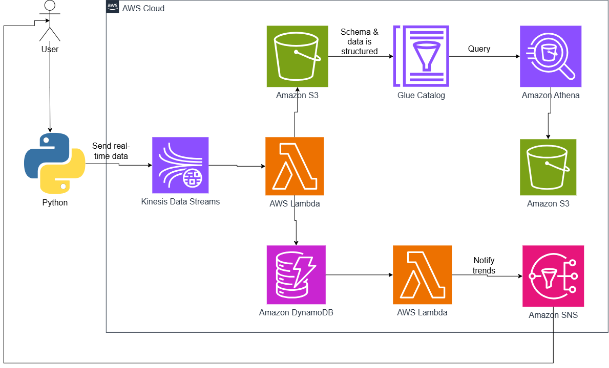
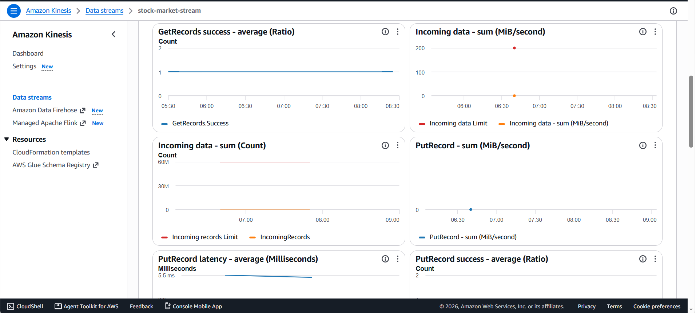
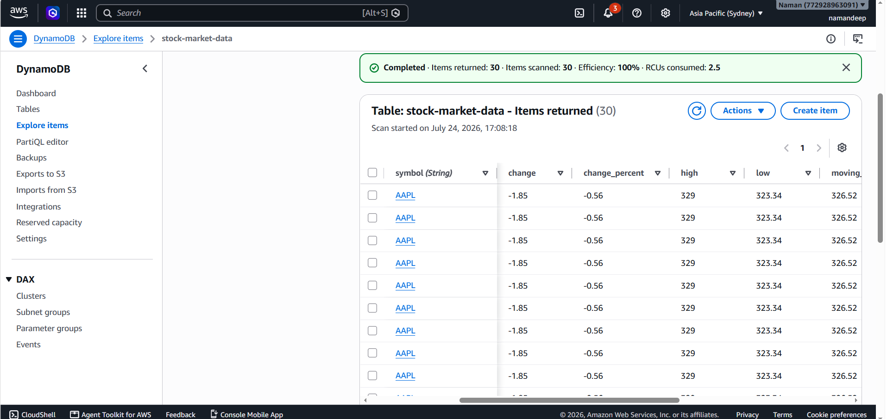
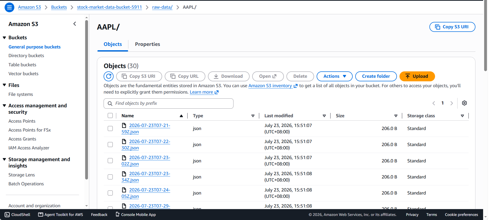
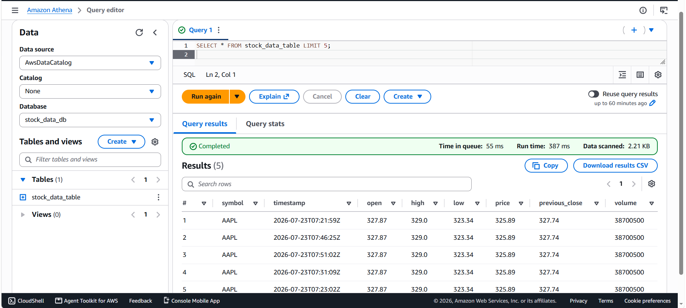
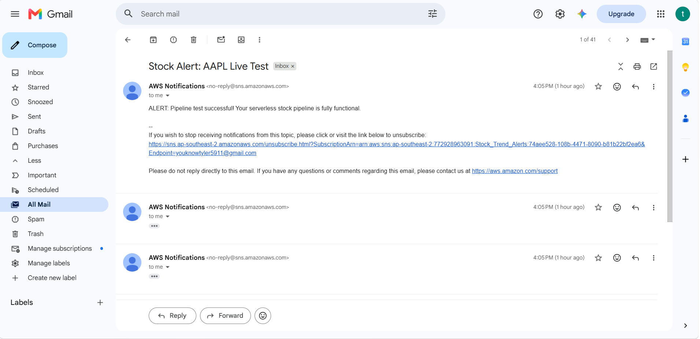

# 🚀 Real-Time Stock Market Data Analytics Pipeline on AWS

## 📋 Overview
A cloud-native, event-driven data streaming pipeline built on AWS to ingest, transform, store, and analyze stock market metrics in real-time. The architecture leverages serverless technologies to maintain a scalable, low-latency infrastructure while minimizing background cloud operational costs.

## 🛠️ AWS Services Used
- Amazon Kinesis Data Streams, AWS Lambda, Amazon DynamoDB & Streams, Amazon S3, Amazon Athena, AWS Glue, Amazon SNS, AWS IAM, Amazon CloudWatch

## 🏗️ System Architecture

## 📸 Project Screenshots
### 1. Real-Time Data Stream Ingestion (Kinesis)

### 2. Processed NoSQL Hot Storage Tier (DynamoDB)

### 3. Historical Data Lake Archive (Amazon S3)

### 4. Serverless Big Data SQL Analytics (Amazon Athena)

### 5. Automated Crossover Alerts Execution (Amazon SNS)

## ✨ Features
- ✅ Near real-time stock ingestion via Kinesis Data Streams
- ✅ Serverless anomaly detection & data cleaning using AWS Lambda
- ✅ Dual-tier storage (Hot NoSQL path & Cold Historical S3 archive path)
- ✅ Push notification alerts (Email/SMS) triggered via DynamoDB Streams

## 🔧 How It Works
1. A Python agent queries financial metrics and streams structured payloads into Kinesis.
2. AWS Lambda consumes the stream records, strips complex data types (`np.float64`), and computes moving averages.
3. Raw JSON logs are safely archived inside S3 while structured records are committed to a DynamoDB table.
4. DynamoDB Streams automatically feed a trend analysis Lambda function, triggering an Amazon SNS alert when short-term and long-term moving averages intersect.

## 👨‍💻 Author
**Namandeep Singh** - Computer Science Graduate

[Portfolio](https://naman5911-code.github.io/.github.io/) | [LinkedIn](www.linkedin.com/in/namandeep-singh-31b2412a1)
